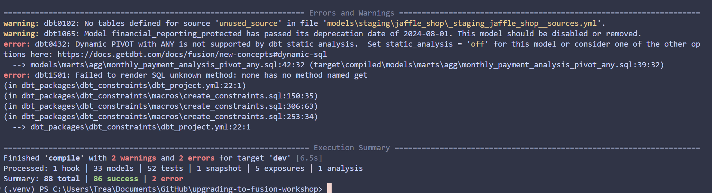
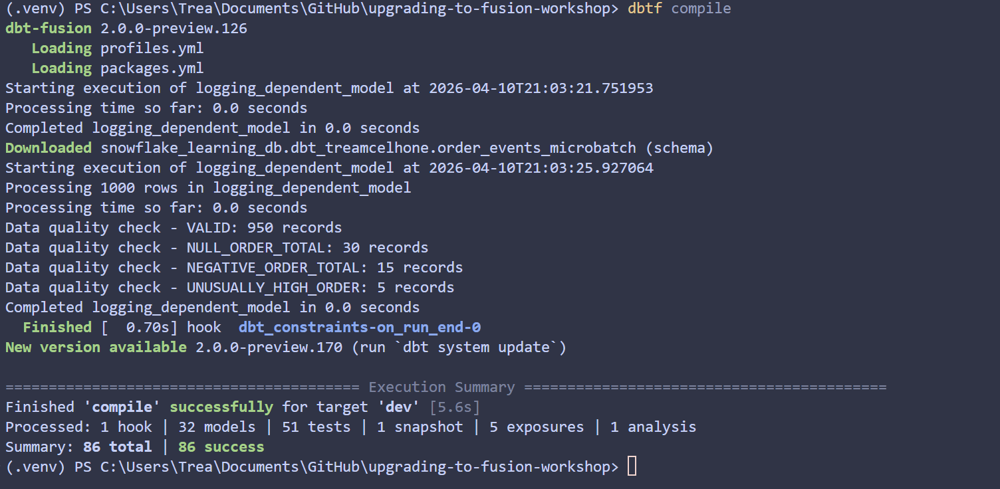

# ⚡ dbt Fusion Upgrade Training Repo  

This repo is a **training project for Coalesce Upgrading to Fusion trainees** to practice upgrading from **dbt Core → dbt Fusion**. It includes a sample dbt Core project plus a mix of **hard and soft blockers** that you’ll need to resolve in order to complete the upgrade.  

The goal: gain hands-on experience troubleshooting and adapting real-world patterns during a Core → Fusion migration.  

---

## 🚀 How to use this repo  

1. **Create your branch**  
   - Branch off `main` using the format:  
     ```
     firstname_lastname_fusion_migration
     ```

2. **Migrate the project**  
   - update the `profiles.yml` and/or the `dbt_project.yml` file to use your Snowflake `ZNA` creds
   - Make sure you run `dbt seed` in dbt Core first to create the underlying data sources
   - Update the repo from dbt Core to dbt Fusion.
     - In VS Code, start by running the migration helper `dbtf init --fusion-upgrade` and follow the workflow
     - This will run the autofix package, anything left over will need to be converted by hand
   - Work through both the **hard blockers** (things that prevent Fusion from compiling/running until fixed) and **soft blockers** (warnings, best practices, or optional improvements).  

3. **Publish your work**  
   - Push your branch to GitHub.  
   - Open a PR for review so others can see how you approached the migration.  

---

## 🔒 Hard vs Soft Blockers  

- **Hard blockers**: Must be fixed before Fusion will run (e.g., deprecated configs, broken macros).  
- **Soft blockers**: Won’t prevent execution but highlight patterns that should be updated for maintainability or Fusion best practices (e.g., model naming, semantic configs).  

---

## 📚 Why this repo exists  

Migrating from dbt Core to dbt Fusion often involves resolving subtle differences in configuration, orchestration, and semantics. This training repo provides a **safe sandbox** to practice:  

- Identifying blockers  
- Applying migration strategies  
- Gaining confidence before working with customer projects  

---

👉 Ready to go? Clone the repo, create your branch, and start your migration journey.

## Screenshot 1
Screenshot after running dbt-autofix packages and deprecations 

## Screenshot 2 
Screenshot after manual fixes 

